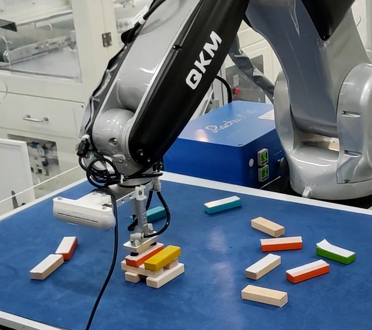

# 《机器人学导论》课程设计

[答辩幻灯片](./share/docs/latex/slide/slide.pdf)

[轨迹规划的数学推导](./share/docs/latex/theoretical-derivations/trajectory-planning.pdf)

Intel Realsense D455相机配合QKM SI7400开放式六轴串联机器人完成堆积木的任务。要求：

- 积木随机散落桌面上；
- 可以指定积木的搭建方法；
- 越高越好，越快越好。

|子任务| 解决方案|
|:------:|:------:|
|手眼标定|迭代法解Perspective-n-Point问题|
|物体识别|HSV颜色分割与矩形识别|
|逆运动学|旋量理论与Paden-Kahan子问题求解|
|路径规划|凸优化求解含约束条件的几何中点|
|轨迹规划|操作空间下梯形速度规划|
|网络通信|Socket实现TCP、FTP协议|
|底层控制|控制器样条拟合Ping-pong buffer点位文件|
|仿真|齐次变换求解正运动学；欧拉角可视化|

- 项目主体使用C++17编写，MinGW g++构建；
- 图形用户界面与刚体位姿仿真使用Python编写。

第三方库：

- `Eigen`线性代数库（坐标变换）
- `OpenCV`计算机视觉（手眼标定、矩形识别等）
- `Poco`计算机网络（FTP）
- `Intel Realsense SDK`相机驱动(捕捉RGB图像)
- `tkinter`Python GUI模块
- `pytransform3d`Python 3D可视化模块
