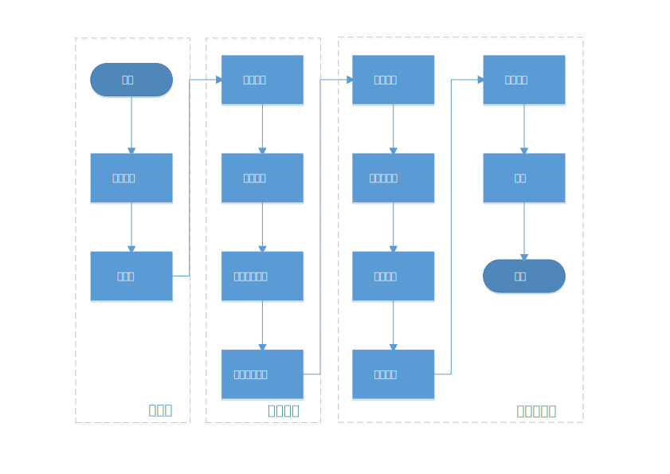
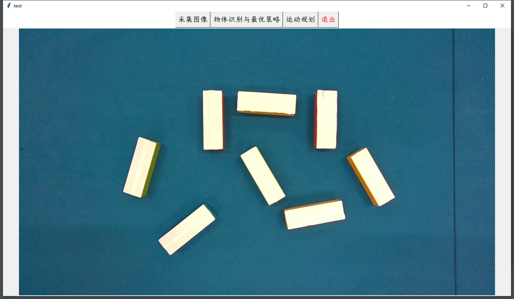
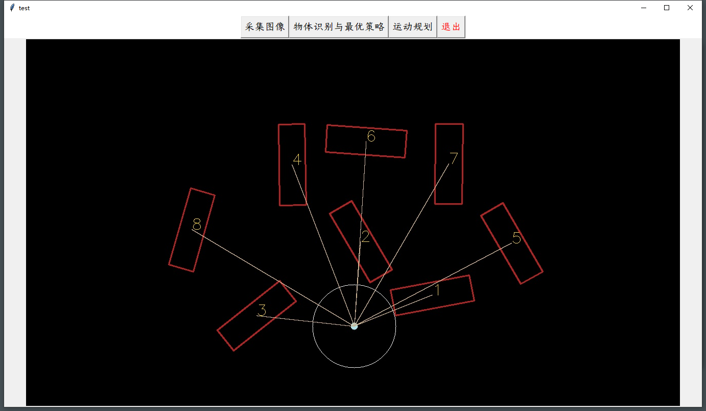
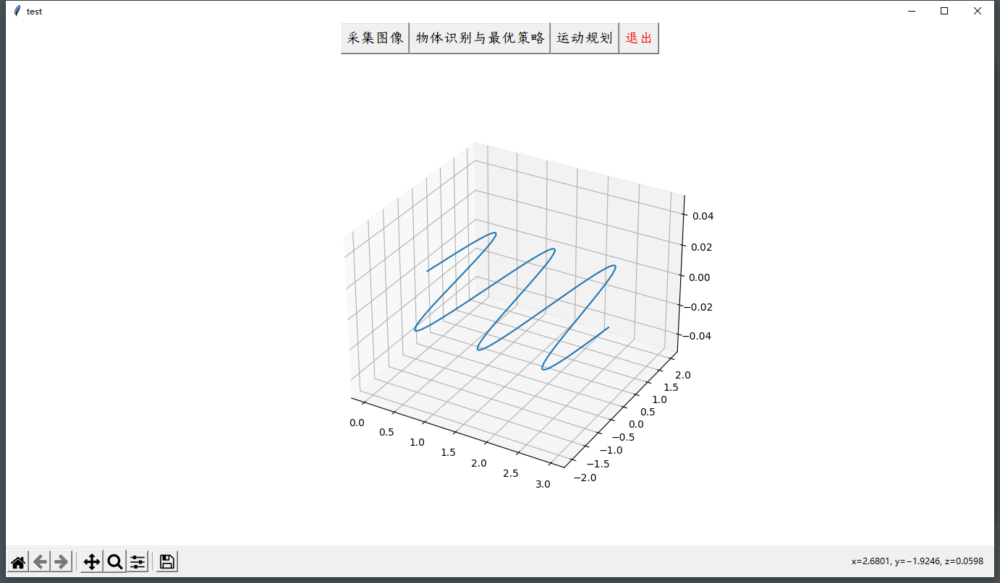

# 《机器人学导论》课程设计

## 整体架构

- 本工程由VScode编辑器配合MinGW-w64-g++编译器构建。
- 图形用户界面使用python编写，主要调用了`tkinter`模块。

## 目前进度与成果

尚未在机器臂上进行试验。目前开发进度如下：

- [x] 初始化
- [ ] 相机标定
- [x] 物体识别
- [x] 确定搭建位置
- [x] 确定搭建顺序
- [ ] 坐标转化
- [x] 路径规划
- [x] 轨迹规划
- [x] 关节解算
- [x] 图形用户界面 

成果展示：

## 原理介绍

### 搭建最优策略的确定

搭建策略的好坏取决于末端执行器的移动总距离。若暂不考虑积木不同搭法的影响，则总距离主要由四个因素决定。

- 运动路径
- 底座中心的位置
- 底座的取向（偏航角）
- 搭建的顺序

为了使总距离最小，

- 运动路径选择直线；
- 底座的取向决定了整个积木塔的角度，暂选择全部积木原有取向的平均值；
- 底座中心的位置选择桌面上与所有积木中心点距离之和最短的点，但要满足一定约束，不可与已有积木重叠。
- 根据勾股定理，与底座中心相距越远的积木应越先被搭建。

需要进一步求解的优化问题是底座中心的位置，数学表述如下（在相机坐标系中）：
$$
\begin{aligned}
&&&p=[x,y]^T,\quad f(p) = \sum_{i=1}^N \Vert p-q_i \Vert\\
s.t.&&&\Vert p-q_i \Vert \geq k\\
\max &&& f(x)
\end{aligned}
$$
目标函数是凸函数，没有局部极值点，可采用迭代方法求数值解。在`geometric-median.cpp`文件中实现。