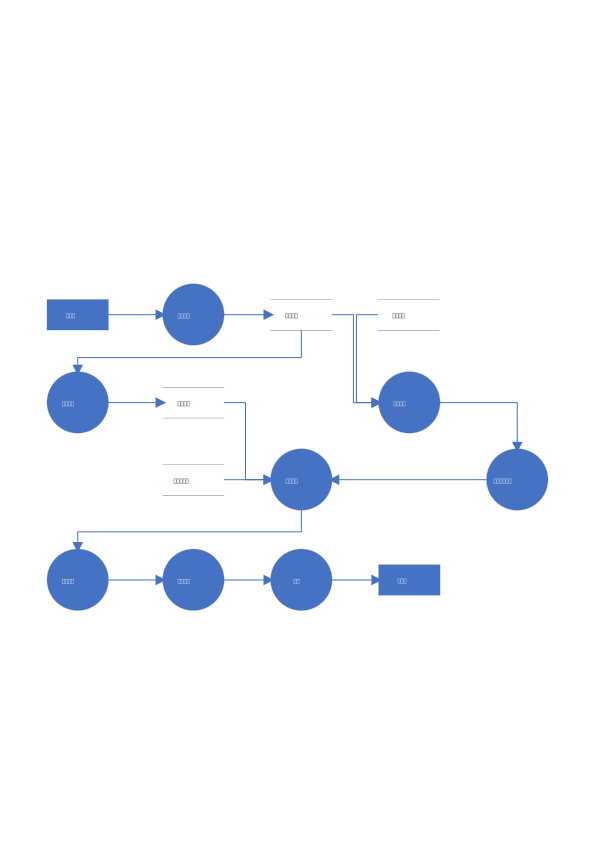
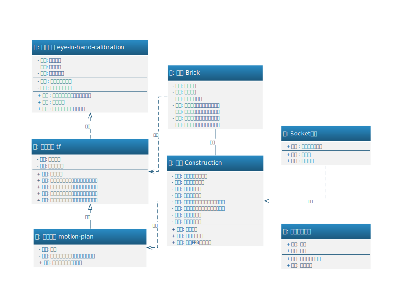
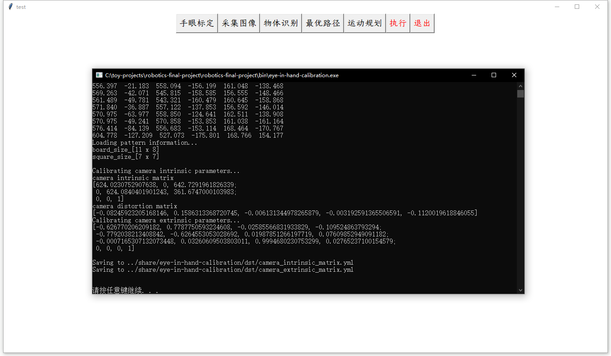
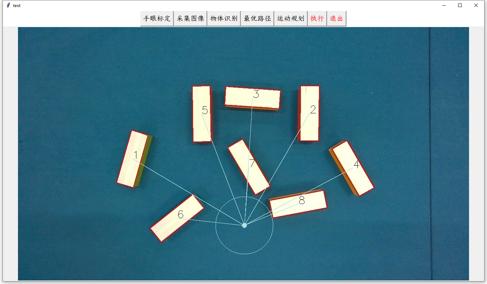
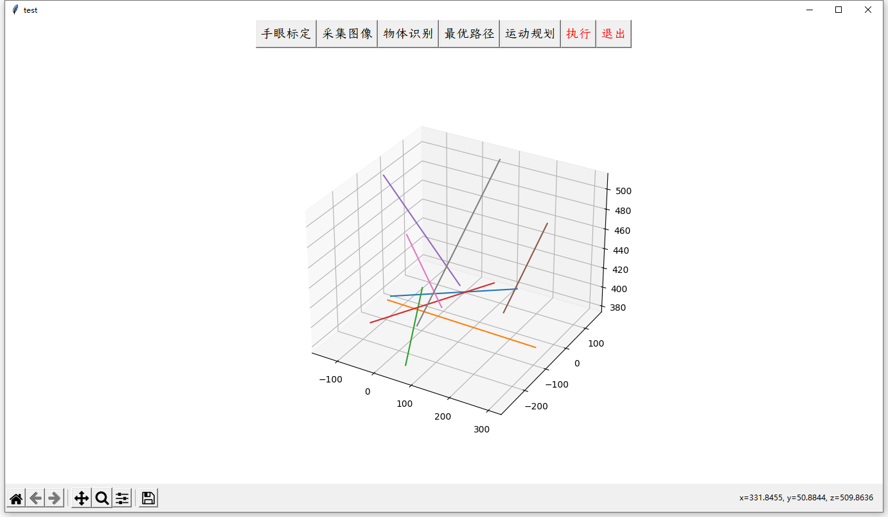
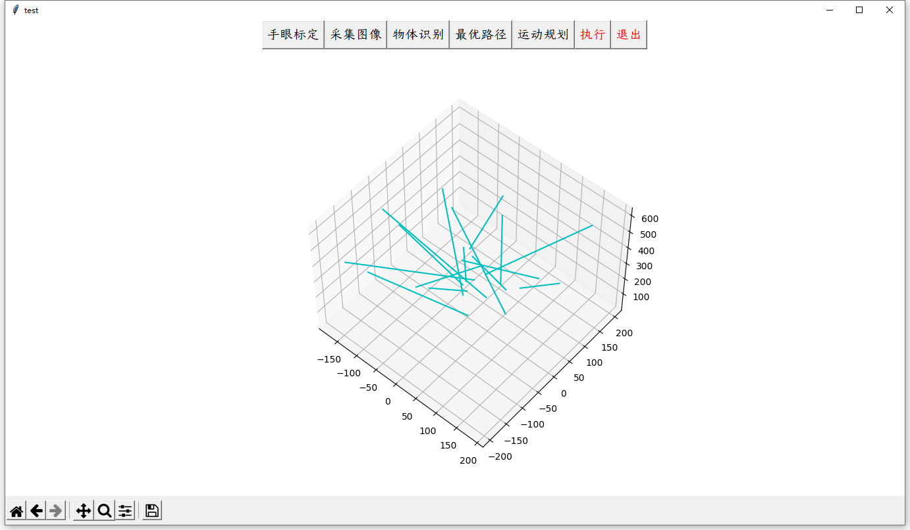

# 《机器人学导论》课程设计

## 任务

Intel Realsense D455相机配合QKM SI7400开放式六轴串联机器人完成堆积木的任务。要求：

- 积木随机散落桌面上；
- 可以指定积木的搭建方法；
- 越高越好，越快越好。

## 设计






## 实现

- 项目主体使用C++17实现，使用MinGW-w64-9.0.0中的g++编译。
- 图形用户界面使用python3编写，主要调用了`tkinter`模块。

```
📦include
┣ 📦Eigen/
┣ 📦OpenCV/
┣ 📦Poco/
┣ 📜brick-construction.h
┣ 📜eye-in-hand-calibration.h
┣ 📜geometric-median.h
┣ 📜motion-plan.h
┗ 📜tf.h
📦src
┣ 📜brick-construction.cpp
┣ 📜communication.cpp
┣ 📜geometric-median.cpp
┣ 📜motion-plan.cpp
┗ 📜tf.cpp
📦test
┣ 📜brick-construction.cpp
┣ 📜eye-in-hand-calibration.cpp
┣ 📜motion-plan.cpp
┣ 📜tf.cpp
┗ 📜GUI-script.py
📦share
┣ 📂eye-in-hand-calibration
┃ ┣ 📂dst
┃ ┃ ┣ 📜camera_extrinsic_matrix.yml
┃ ┃ ┣ 📜camera_intrinsic_matrix.yml
┃ ┗ 📂src
┃ ┃ ┣ 📜01.png
┃ ┃ ┣ 📜02.png
┃ ┃ ┣ 📜...
┃ ┃ ┗ 📜rpy.txt
┣ 📂motion-plan
┃ ┣ 📂simulation
┣ 📂target-recognition
┃ ┣ 📂dst
┃ ┗ 📂src
┃ ┃ ┗ 📜img_src.jpg
┗ 📜log.txt
```


## 进展











## 原理

…